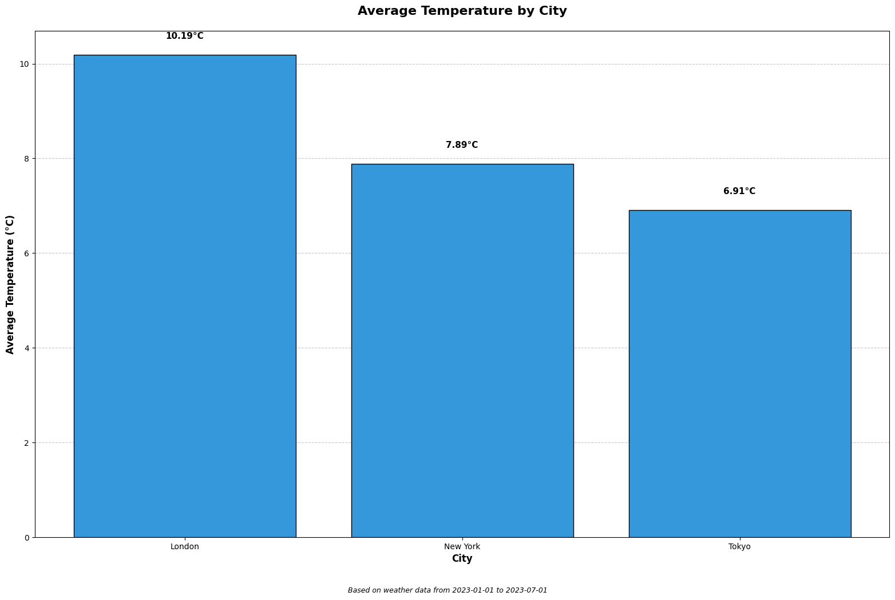

# Weather Data Processing Pipeline

This repository contains a data processing pipeline for cleaning, transforming, and analyzing weather data. The pipeline processes raw weather data from a CSV file and generates cleaned data, reports, and visualizations.

## Table of Contents

- [Overview](#overview)
- [Installation](#installation)
- [Running the Pipeline](#running-the-pipeline)
- [Approach & Challenges](#approach--challenges)
- [Output Files](#output-files)
- [Sample Visualization](#sample-visualization)

## Overview

This pipeline performs the following operations on weather data:

- Data loading and inspection
- Cleaning missing values
- Standardizing date formats
- Converting temperature from Celsius to Fahrenheit
- Filtering out records with unknown weather conditions
- Generating reports and visualizations

## Installation

### Prerequisites

- Python 3.8 or higher
- Jupyter Notebook
- pandas
- matplotlib
- numpy

### Setup

1. Clone this repository:

```bash
git clone https://github.com/zbluee/Weather-Data-Processing-Pipeline.git
cd Weather-Data-Processing-Pipeline
```

2. Install the required dependencies:

```bash
pip install pandas matplotlib numpy jupyter
```

3. Place the input data file (`weather_data.csv`) in the src project directory.

## Running the Pipeline

You can run the pipeline using the Python script:

```bash
python jupyter notebook weather_data_processing_pipeline.ipynb
```

## Approach & Challenges

### Approach

I approached this data processing task with the following methodology:

1. **Data Exploration**: First, I examined the data structure to understand its contents and identify potential issues.

2. **Data Cleaning Strategy**:

   - For missing dates, I chose to drop the rows since date is a critical field
   - For missing numerical values, I used city-specific aggregates (mean for temperature and wind speed, median for humidity)
   - For the weather condition field, I filtered out unknown or NanN missing values

3. **Date Standardization**:

   - I implemented a robust date parsing solution that handles multiple formats
   - The function detects the format based on separators and numeric patterns
   - Special handling was added for distinguishing between MM/DD and DD/MM formats

4. **Data Transformation**:
   - Added Fahrenheit temperature using the standard conversion formula
   - Ensured all data types were appropriate (especially datetime for dates)
   - Created aggregations for reporting and visualization

### Challenges Faced

1. **Date Format Standardization**:

   - The date column contained multiple inconsistent formats (YYYY-MM-DD, MM/DD/YYYY, DD/MM/YYYY, DD.MM.YYYY)
   - Disambiguation between MM/DD and DD/MM was particularly challenging when both values were ≤ 12
   - Solution: Used a combination of pattern detection and heuristics based on separators
   - Weather condition values were inconsistently formatted with different capitalization and typos (e.g., "RAINY", "Rainy", "Unkown", "unkwon")
   - This made filtering and analysis challenging as the same conditions were recorded differently
   - Solution: Applied string transformation using the str.title() method to standardize all weather condition values before filtering

2. **Handling Missing Values**:
   - Needed to maintain data integrity while dealing with missing values
   - Solution: Used group-specific aggregates rather than global ones for more accurate imputation

## Output Files

The pipeline generates the following output files in the `outputs` directory:

1. [`transformed_weather_data.csv`](outputs/transformed_weather_data.csv): The cleaned and transformed weather data
2. [`city_temperature_ranking.md`](outputs/city_temperature_ranking.md): A markdown report listing cities by average temperature
3. `average_temperature_celsius_by_city.png`: A bar chart visualization of city temperatures

## Sample Visualization

Below is a sample of the temperature visualization generated by the pipeline:



This bar chart provides a clear visual comparison of the average temperatures across the cities in the dataset.

---

_Note: When reading transformed_weather_data.csv back into pandas, use `parse_dates=['date']` to ensure the date column is correctly interpreted as datetime objects._
